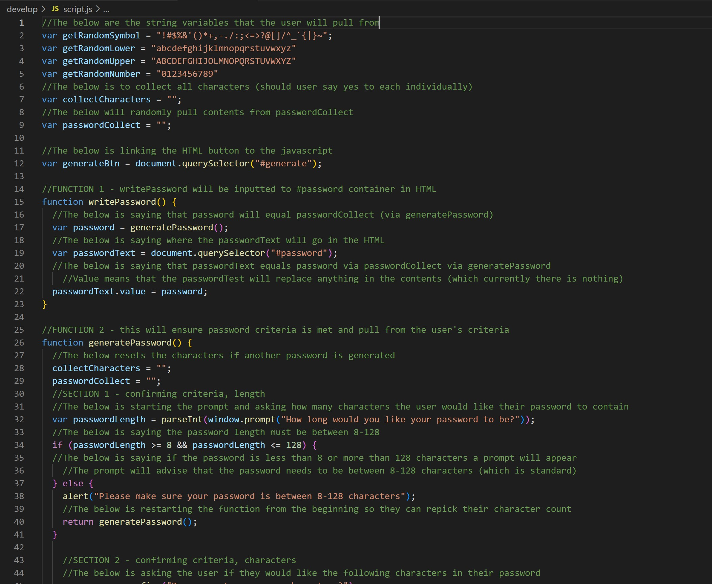

# Password Generator

## Goal
The goal was to create, using JavaScript, a password generator that the user would be able to select certain criteria pertaining to their needs and thus generating a password. This goal was accomplished.

## JavaScript Code Breakdown
It was imperative to breakdown the sequence of events. Once it was determined what needed to be done, two functions seemed to be key to the success of this. One was pre-written and provided. The second used if and else statements, as well as a loop to secure chosen criteria from the user. Notes were written into the JavaScript file to help with the understanding of the code.

## Notes
As I was new to this, I received help from TA's Cody and Manan. They were both amazing and helpful with explaining things. Cody helped me with the code from scratch. Once completed and our session ended I noticed an issue that I was unable to resolve. Manan helped me resolve this while also making me think. He also pointed out an error and left my on my own to resolve. I am proud to say I was able to fix this on my own. I also learned that dumbing down my JavaScript code in a way that anyone could read it will help me in the future.

## Final Product
[Click here to view](https://jessicamdittrich.github.io/CHG-JD051922)